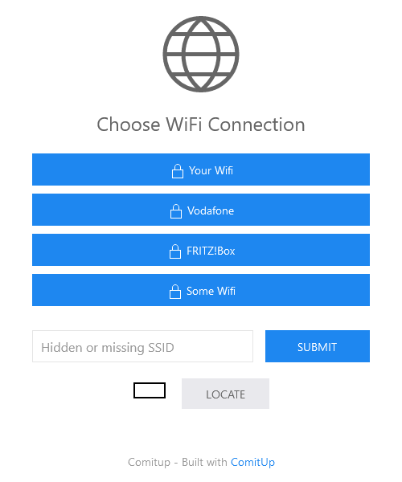

# OpenMowerOS

*Based on [CustomPiOS](https://github.com/guysoft/CustomPiOS)*

This repository contains the official OpenMowerOS image for running the [OpenMower](https://github.com/ClemensElflein/OpenMower) project.

Currently this is based on the latest RaspberryPi OS with the following changes:

- **[Comitup](https://github.com/davesteele/comitup)** opens a WiFi hotspot if no known network can be found. Connect to it with any device to connect the robot to your network.

- **podman** fetches the latest version of the open-mower software and runs it for you automatically.

- **OpenOCD** is installed with GPIO support, so you can flash your pico's firmware from the Pi4

- **socat** allows you to redirect your Ardusimple to u-center for configuration

***

## Important Information

- **hostname**: OpenMower

- **username**: openmower

- **password**: openmower ***CHANGE IT! (use `passwd` for that)***

- **ssh**: enabled on port 22

- **hotspot SSID**: OpenMower-\<somenumber\>

- **default hotspot password**: OpenMower

- **mower_config.sh**: Is in the /boot directory and can be edited with any PC after flashing the SD card

- **mower_version.sh**: Is in the /boot directory and can be used to select the version to run.

***

## How to Get Started

### Required

 1. Burn the latest image available to an SD card.

 2. Open the SD cards `boot` partition and there the `openmower` folder.

 3. Edit the `hotspot` file to configure the fallback hotspot. **Change the pw and remember it!**

    You find a `hotspot.example` in there too.

    On boot the system will apply the settings and rename the `hotspot` to `hotspot.settings-applied`.

 4. *(Open the `openmower_version` and read its explanation.)*

 5. Edit the `mower_config` file:

    - check for the latest revision of that file [here](https://github.com/ClemensElflein/open_mower_ros/blob/main/src/open_mower/config/mower_config.sh.example).

    - if the files differ apply the newest changes.

    - add you changes to that file.

 6. Eject the card, put it in the mower (do not close the mower yet) and turn it on.

 7. After a short time the hotspot wifi should appear - connect to it.

    - Once you are connected to the hotspot you default browser should automatically open and you should see the wifi configuration webpage:

      

    - Click on your home wifi and fill in you password.

    - The hotspot will disappear and the mower should connect to your wifi

 8. Check your router for the mowers IP adress (and optionally set a static one)

 9. SSH to your mower *(the default credentials are above)*

10. Change you password! (`passwd`)

11. If you have `mower_config` and `openmower_version` configured you can now start openmower by executing `sudo systemctl start open_mower_ros`
      - on slow SD cards the first start can take ~10min +

12. check if everything runs fine by accesing the logs `sudo podman logs -f open_mower_ros`

13. If everything works you can set openmower to run at boot `sudo systemctl enable open_mower_ros`

- If you later want to edit `mower_config` it is located on the pi at `/boot/openmower/mower_config`

### Optinal

- theoretically there is an auto update feature for podman but is it not tested yet

For ROS specific commands (e.g. `rostopic echo`) use `podman exec -it open-mower /openmower_entrypoint.sh /bin/bash` to access ROS
