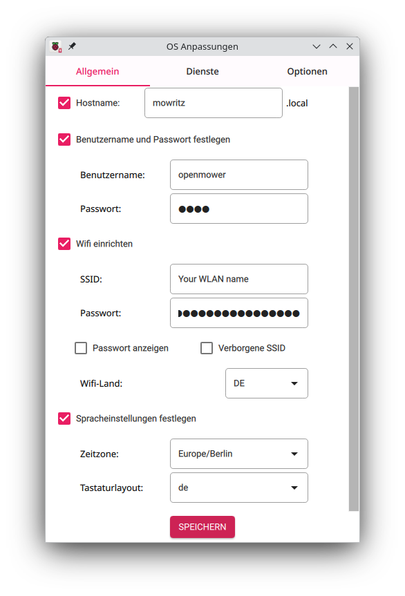
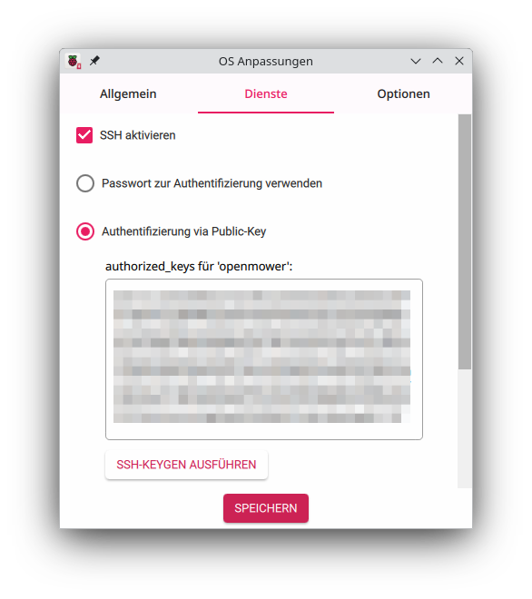
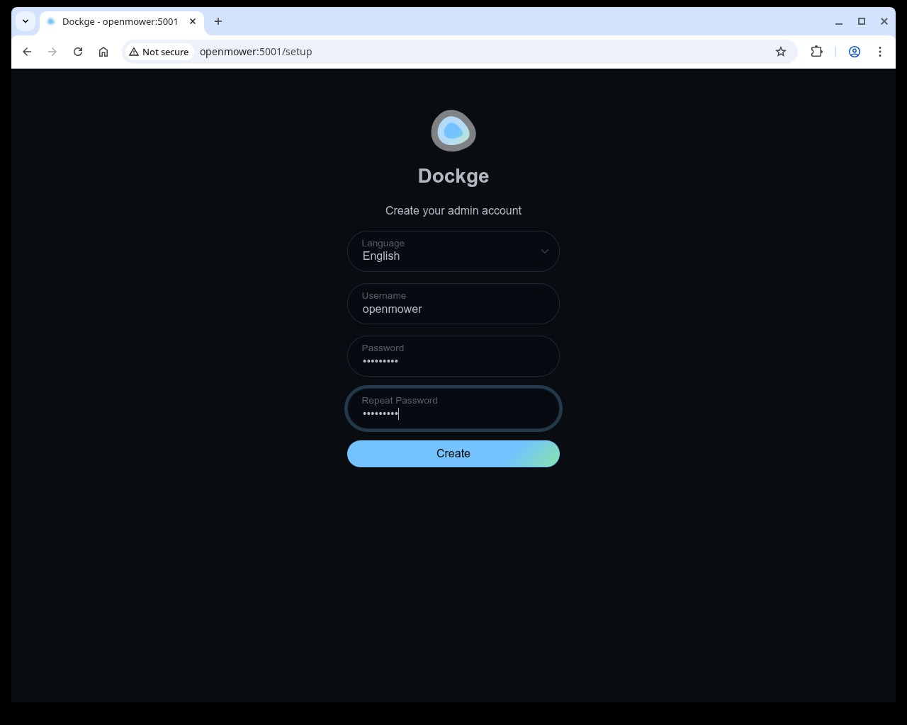
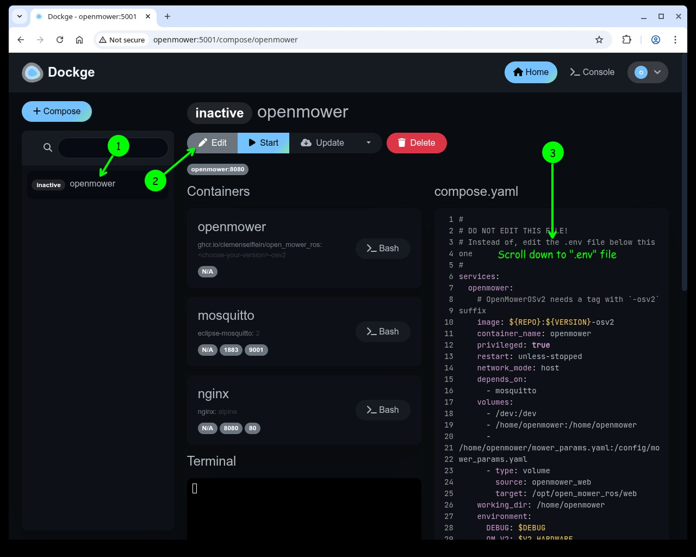
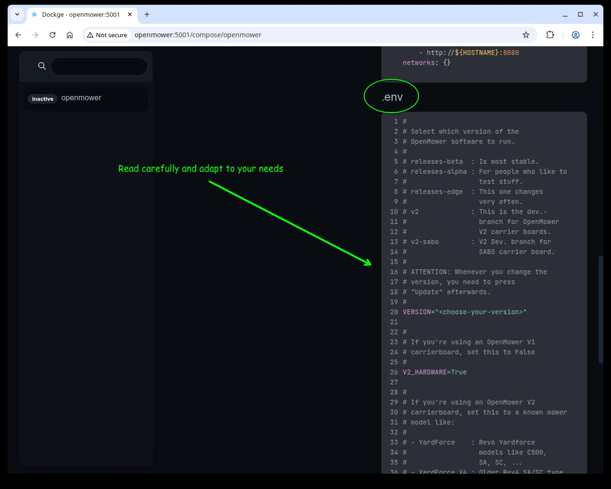
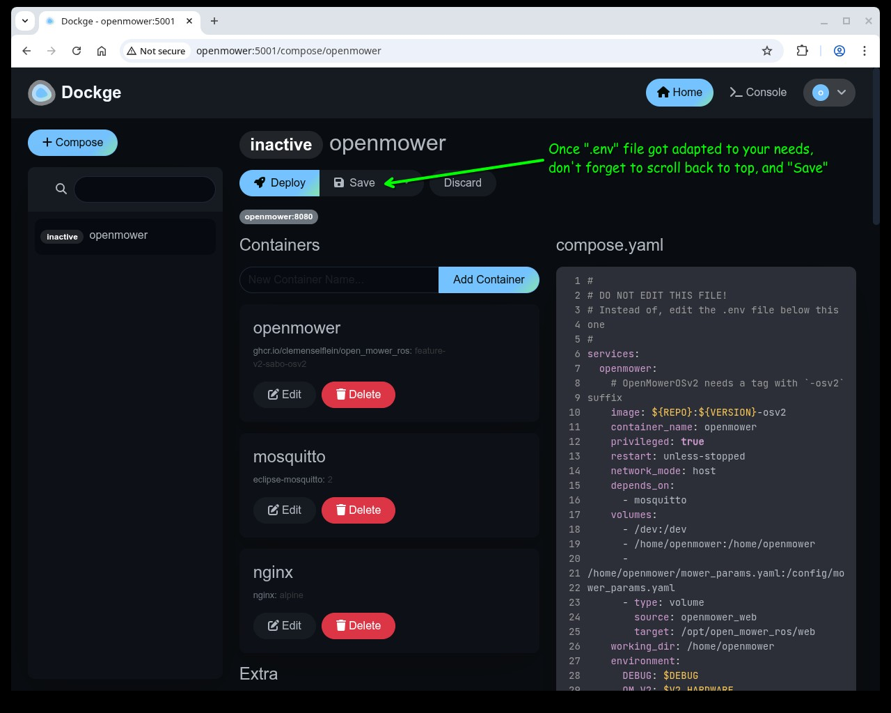
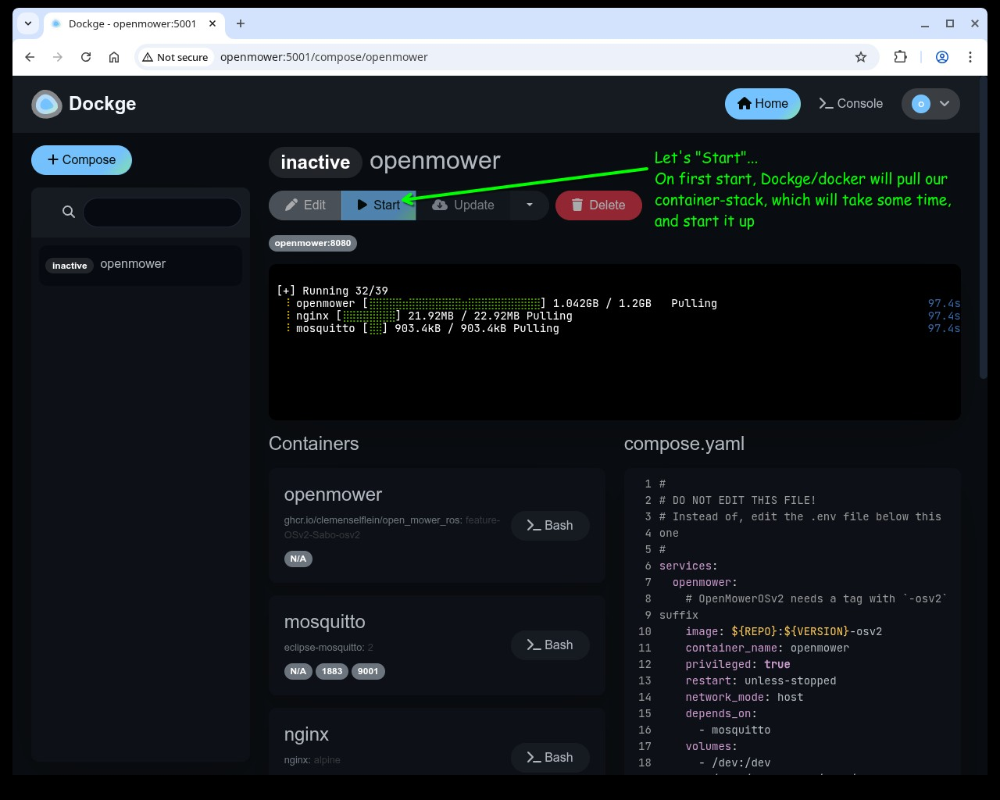
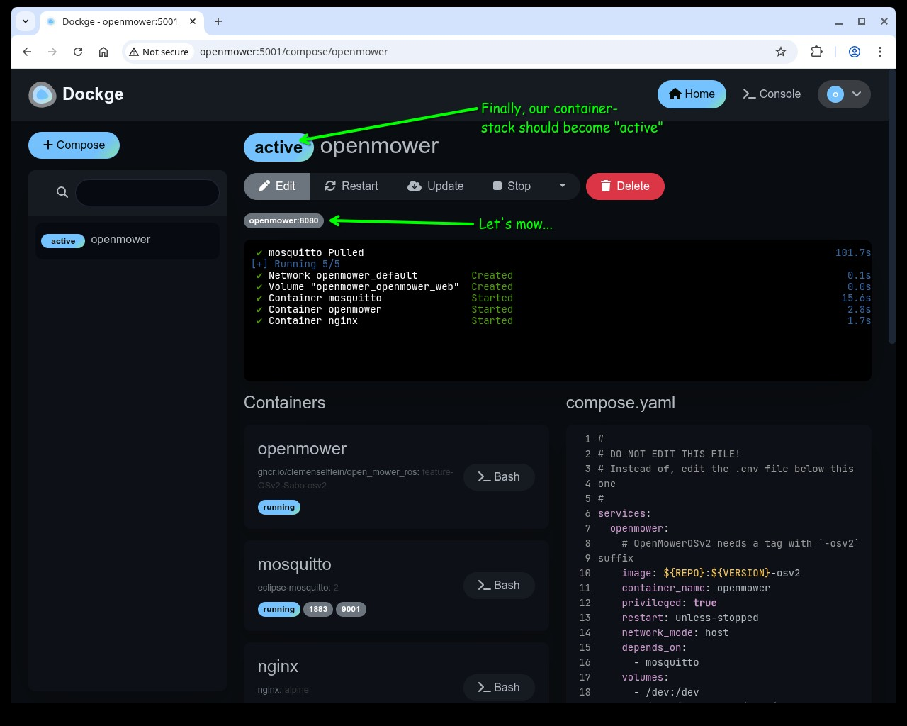

# OpenMowerOS

[](https://github.com/ClemensElflein/OpenMower)

This repository contains the official OpenMowerOS (OMOSv2) image for running the [OpenMower](https://github.com/ClemensElflein/OpenMower) project on your OM's Pi4/CM4.

➡️ What’s new in the latest release? See [WHATSNEW.md](./WHATSNEW.md).

## Reference/Default Information

- **hostname** : openmower (default)

- **username** : openmower (fixed)

- **password**: openmower ***CHANGE IT! (use `passwd` for that)***

- **ssh**: enabled

- **hotspot SSID**: OpenMower-\<somenumber\> (no password)

***

## How to Get Started

Tip: Click a section title to expand/collapse.

<details>
<summary><b>Install OpenMowerOS on your Pi4/CM4</b></summary>


1. Flash the latest image (link TODO) to an SD card, preferably using [**Raspberry Pi** Imager](https://www.raspberrypi.com/software/).

2. ***Optional: Raspberry Pi Imager configuration***<br>
   When prompted by Raspberry Pi Imager, you can change some custom settings:
   1. As shown here, but never use a username other than `openmower`!<br>
   
   2. You may also add your SSH public key for quicker SSH login;
   password login remains active (even if it's an either/or selection).<br>
   
   
</details>

<details>
<summary><b>First boot and network setup</b></summary>

3. After writing the image, eject the card, insert it into your mowers Pi4 or xCore, and turn it on.

4. Your Pi will boot multiple times.<br>
   ***Sometimes, after the first boot, it may fail to reboot*** (red LED near the HDMI plug remains on, whereas the green one doesn't flicker anymore). If that happens, a power cycle will get it back on track.

5. ***Optional: Comitup hotspot (if you skipped step 2 "Raspberry Pi Imager configuration")***<br>
If you didn't enter your Wifi settings when asked for the custom settings during Pi Imager (see step 2), or if you accidentally entered the wrong Wifi settings:

   1. After a short time, an "OpenMower-\<somenumber>" Wifi hotspot should appear. Connect to it.

   2. Once you are connected to the OpenMower-\<somenumber> hotspot, your default browser should open automatically and display the WiFi configuration page (if not, open http://10.41.0.1).

      <p align="center"></p>

   3. Click on your home WiFi and fill in your password.

   4. The hotspot will disappear and the mower should connect to your WiFi.

6. Try pinging your mower via `ping openmower` (or the hostname you entered during Pi Imager). If the host can't be found, check your router for the mower's IP address.

7.  SSH into your mower via `ssh openmower@openmower` or `ssh openmower@<your hostname or mower's IP address>` (password 'openmower' or the one you entered during Raspberry Pi Imager).

8. ***Optional:***<br>
   1. If you didn't configure a custom password during step 2 (Raspberry Pi Imager configuration), change your password now via `passwd`.
   2. Use `raspi-config` to change keyboard, timezone, WLAN country and the like (if not configured in Raspberry Pi Imager's custom settings).

 </details>

<details>
<summary><b>Manage OpenMower stack (GUI + CLI)</b></summary>
 
Dockge (a container manager GUI), as well as a ttyd (a WebTerminal) are automatically pulled and started after 2-5 minutes (after final boot).

The WebTerminal is available as a lightweight alternative to SSH for running the same commands.
It can be reached via `http://openmower:7681` (adjust if you changed the hostname).
Default login credentials: openmower/openmower.

For each relevant GUI action, a CLI alternative is available via a powerful `openmower` command; both are listed below.

1. Connect to the container manager:
   - GUI: Open <http://openmower:5001> (or your individual hostname if changed), and login by entering the default Dockge admin user `openmower/openmower`:
       
   - CLI:
     - SSH into your Pi: `ssh openmower@openmower` (or your configured hostname).
     - WebTerminal via URL `http://openmower:7681` (or your configured hostname).

2. Configure the stack (.env)
   - GUI:
       
       
       
   - CLI: `openmower configure`

3. Start the stack (inclusive initial pull)
    - GUI:
       
    - CLI:

       ```bash
       openmower pull
       openmower start
       ```

4. Check status and open the OpenMower webApp
   - GUI:
       
   - CLI: `openmower status` should list three services (open_mower_ros, Mosquitto, OpenMowerApp), all with status 'up'. If so, open a browser and visit `http://openmower:8080` (or your configured hostname).

</details>

